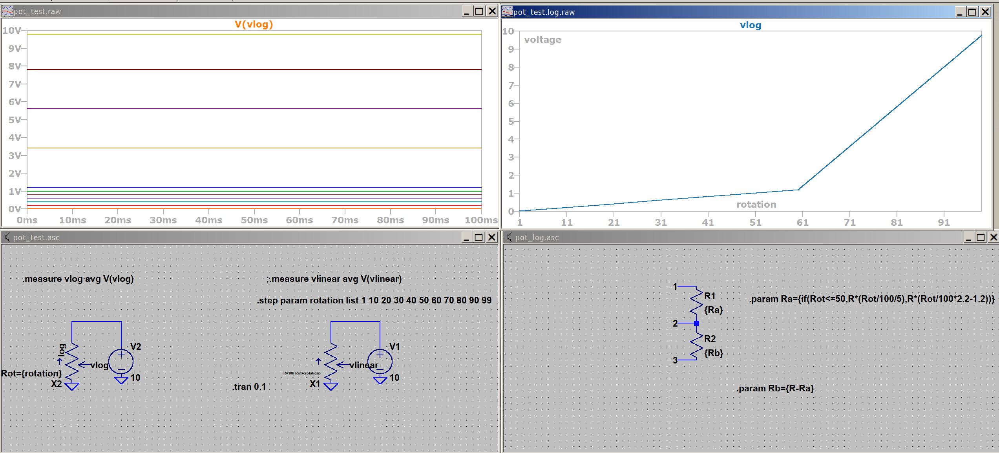

This is a simple potentiometer part for LTspice.
There are lin and log.
To use them you need to put them in the local folder where your simulation lives
or put them somewhere in the LTspice folders (I can't remember where exactly).
If you have them in the local folder, you might need to switch the "Top
Directory" Pulldown in the "Select Component Symbol" dialog to the local folder
(and then back again ;-)).
Edit (total) resistance and rotation position in the
right click menu. I recommend checking the "visible" checkbox next to the PARAM
field, so you see the state in your schematic.
Turn direction in indicated by the arrow, this points in the clockwise turn
direction.

AND PLEASE DOUBLE CHECK IF I GOT THE DIRECTION RIGHT!! ;-)

